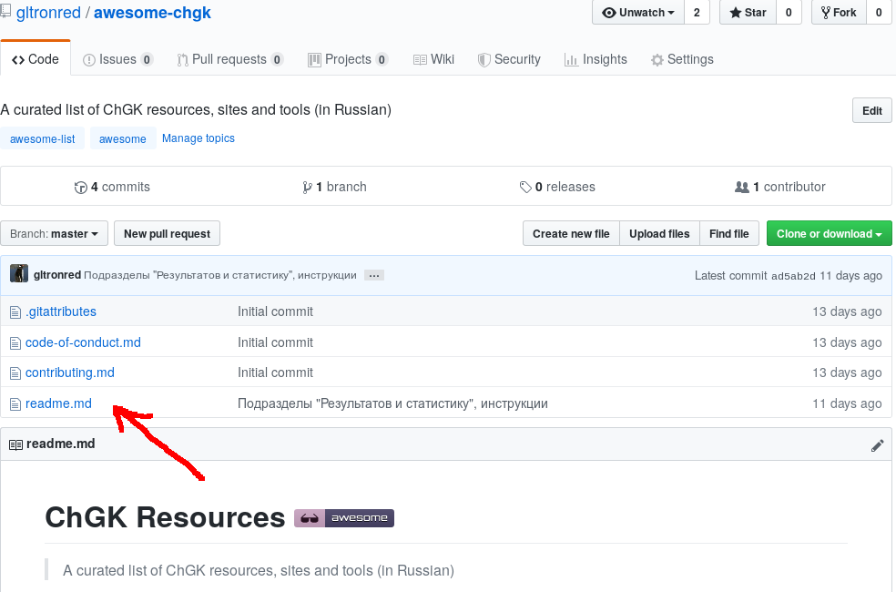
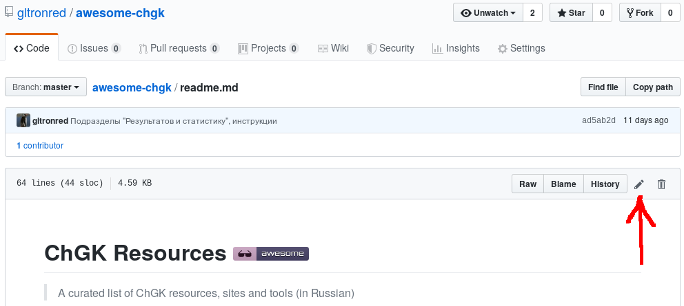

# Как пополнить список?

В этом проекте есть [правила поведения](code-of-conduct.md). Участвуя в проекте, вы соглашаетесь с ними.

---

## Добавление в список

Если вы хотите добавить что-нибудь замечательное околоЧГКшное, вот как это сделать.

Вам нужен [аккаунт на Github](https://github.com/join)!

1. Зайдите на страницу со списком: https://github.com/gltronred/awesome-chgk
2. Нажмите на файл `readme.md`: 
3. Теперь нажмите на иконку изменения: 
4. Вы можете редактировать текст, используя редактор, встроенный в браузер. Можно использовать [Markdown](https://help.github.com/articles/github-flavored-markdown/). Пожалуйста, удостоверьтесь, что ваши изменения подходят по [формату](#формат-списка). 
5. Напишите, почему вы предлагаете эти изменения и затем нажмите на "Propose file change". 
6. Отправьте [пулл-реквест](https://help.github.com/articles/using-pull-requests/)!

Этот раздел является вольным переводом [соответствующего документа из
awesome](https://github.com/sindresorhus/awesome/blob/master/contributing.md)

---

## Формат списка

Пожалуйста, убедитесь, что ваши изменения соответствуют следующим требованиям.

- Язык описаний - русский. Пока ЧГК является игрой для, в основном, русскоязычной аудитории. В названиях и описаниях не должно быть орфографических ошибок.
- Каждая строка списка должна содержать название проекта и ссылку на него. Первая буква названия должен быть заглавной, если только названием не служит URL. Каждая строка списка должна завершаться точкой.
- Рекомендуется для каждого элемента оставить короткое описание, почему этот проект замечательный. Описание должно быть по существу, а не девизом проекта или маркетинговым бредом.
- Новые элементы списка должны добавляться в конец списка.
- В списках не должно быть дубликатов. Пожалуйста, проверьте, что это так.
- Инструкции могут находиться на внешних ресурсах, если вы уверены, что внешние ресурсы достаточно надежны и проживут долго. Если это не так, инструкции лучше вносить в отдельный markdown-файл в репозитории.

## Дополнительные требования к текстам инструкций в репозитории

- Название файла должно быть на английском языке. Расширением файла должно быть `md`.
- Если нужно вставить изображения, поместите их в подпапку папки images. Подпапка должна называться так же, как и файл (без расширения md).

---

## Изменение структуры списка, структуры репозитория или правил

Если вы хотите изменить что-то из перечисленного, пожалуйста, откройте отдельную задачу для обсуждения этого изменения. 

В задаче должно быть описано предлагаемое изменение и зачем это нужно сделать.

---

## Updating your PR

A lot of times, making a PR adhere to the standards above can be difficult.
If the maintainers notice anything that we'd like changed, we'll ask you to
edit your PR before we merge it. There's no need to open a new PR, just edit
the existing one. If you're not sure how to do that,
[here is a guide](https://github.com/RichardLitt/knowledge/blob/master/github/amending-a-commit-guide.md)
on the different ways you can update your PR so that we can merge it.
